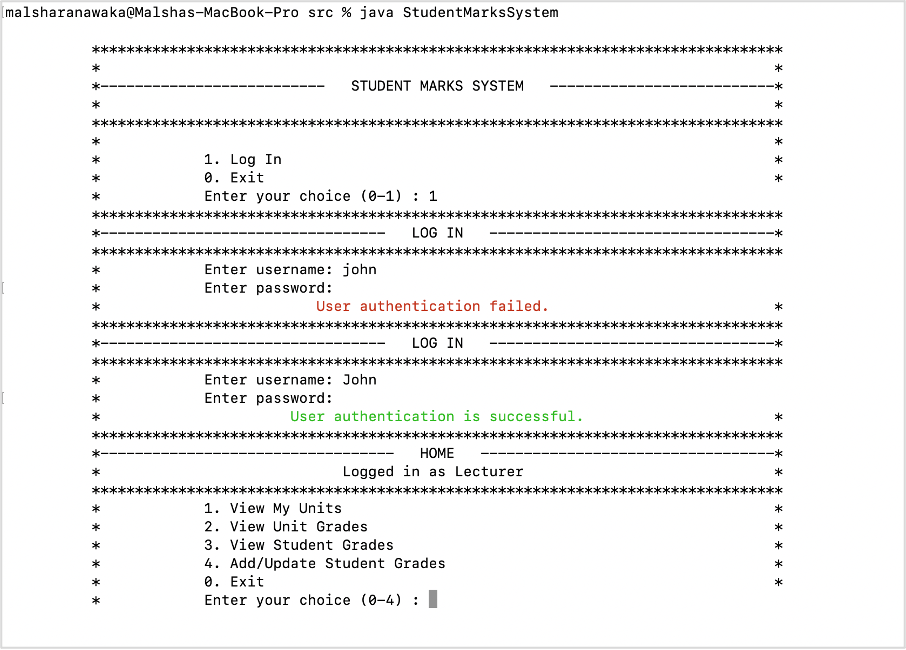

## Student Marks System

This application stores and manages student marks in a university. It's implemented using Java, with a command line-based interface for 
users to interact with the system. All the records related to the application are stored and retrieved from csv files.

## Run the project

To run the project, run the following commands in the terminal/command prompt.

```shell
cd src
javac */*.java
javac StudentMarksSystem.java
java StudentMarksSystem
```

To login, use the following username and password combinations.

`John, john`

`Anne, anne`

## Functionalities in the Application

Object-oriented programming principles and Java language aspects were used when designing the application. The main user of the application is a Lecturer at the university.
Users can perform following operations within the system.


### Login Screen



### All Units Screen


### Grades for Units


### Grades for Students


### Update Grades


## Application Design

### User Experience and Interface

Colors added using ANSI codes to enhance the display of error and information messages.


### MVC Based design


